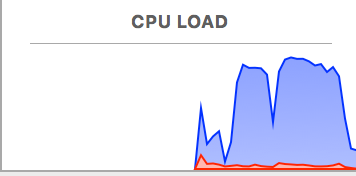

GORM : batch importing large datasets and a performance benchmarking app
===================================

Summary
--------

We have a new client that will be importing large payment data files into out application and it appears that this topic ([Zach][]) has some common mind share right now. Over the years I have seem many recommendations for hibernate performance tuning with large sets of data and most recently for GORM as well. What I haven't seen are any sample straight forward benchmark apps to fiddle with.
So I jammed the beginnings of one together and here it is. 

How to run the benchmarks
-------
- build runnable war using command, ```gradle clean assemble```
- Go to build/lib directory, Run the application with command ```java -jar grails-gpars-batch-load-benchmark-0.1.war``` 
- Benchmarks are run from the BootStrap.groovy. You will see the results on console. 


Build war with AuditTrail enabled
----
By default AuditTrail is disabled.  
Audit trail AST Transformation can be enabled by passing system property auditTrail.enabled=true during compilation time.  
```gradle clean assemble -DauditTrail.enabled=true```

Run with autowire disabled
----
By default Gorm domain autowire is enabled. Domain autowiring can be disabled by passing system property autowire.enabled=false
```java -Dautowire.enabled=false -jar grails-gpars-batch-load-benchmark-0.1.war```


The Bemchmarks
-------
1. GPars_batched_transactions_per_thread : Runs the batches in parallel, each batch being the same size as jdbc batch size (50).
2. GPars_single_rec_per_thread_transaction : Gpars Single thread par transaction
3. single_transaction : Insert all records in a single transaction and commit at the end. No Gpars.
4. GPars_batched_transactions_without_validation : Gparse batched, with data binding, without validation
5. GPars_batched_transactions_without_binding_validation: Gparse without data binding, without validation
4. commit_each_save: Insert each record in individual transactions and commit. No Gpars.
5. batched_transactions: Run batch insert as 1) but without Gparse.

Note: All of above benchmarks are run with and without data binding, and you will see the results for both.

**By default, all benchmarks are run with Gorm domain autowiring enabled.** 
If you want to see effect of disabling autowiring in domains, just set gorm autowire to false in application.yml


My Bench Mark Results and details
-------

* 115k CSV records on a MacBook pro 2.5 GHz Intel Core i7. 2048 mb ram was given to the VM and these were run using ```java -jar grails-gpars-batch-load-benchmark-0.1.war```
* all of these have jdbc.batch_size = 50 and use the principals from #2 above and flush/clear every 50 rows
* The test where the batch insert happen in a single transaction can't be tested with GPars since a single transaction can't span multiple threads
* the winner seems to be gpars and batched (smaller chunks) transactions


**Results with Gparse pool size 8**

|                      | All records in single transaction | Commit each record | Batched Transaction - Without Gpars  | Batched Transactions - With Gpars  | Gpars single transaction per thread  |
|----------------------|-----------------------------------|--------------------|--------------------------------------|------------------------------------|--------------------------------------|
| With data binding    | 40.807                           | **81.521**          | 43.569                              |  12.32                              | 22.372                               |
| Without data binding | 20.295                            | 43.498             | 20.283                               | **6.842**                          | 16.432                               |
|                      |                                   |                    |                                      |                                    |                                      |


**Results for Gparse batched with different pool sizes**

| Pool size                             |  2 threads | 3 threads | 4 threads | 5 threads | 6 threads | 7 threads | 8 threads | 9 threads | 10 threads | 11 threads | 12 threads |
|---------------------------------------|------------|-----------|-----------|-----------|-----------|-----------|-----------|-----------|------------|------------|------------|
| With data binding    | 24.522     | 22.473    | 16.063    | 17.363    | 16.698    | 14.53     | 12.32     | 12.012    | 12.145     | 14.785     | 14.081     |
| Without data binding | 12.302     | 12.593    | 9.52      | 8.586     | 8.509     | 7.46      | 6.842     | 6.27      | 6.696      | 6.896      | 7.074      |
| No validation                    | 15.335     | 17.588    | 9.906     | 10.3      | 10.724    | 9.489     | 7.993     | 8.112     | 8.203      | 9.069      | 9.032      |
| No validation & No data binding    | 10.619     | 9.311     | 7.088     | 7.59      | 7.997     | 8.088     | 6.558     | 5.896     | 5.683      | 6.223      | 6.594      |


| gpars benchs      | time |
|-------------------|------|
|with databinding   | 12.32  |
|no binding         | 6.842 |
|No autowire        | 12.969 |
|no validation      | 7.993 |
|no binding, no autowire,  no validation | 6.221 |
|grails date stamp fields | 14.726 |
|audit-trail stamp fields (user and dates)| 21.728 |
|no dao            | 10.603 |
|DataflowQueue (CED Way) | 14.6 |


CPU Load during Gparse batch insert
--------
It can be seen that cpu load goes highest during Gparse batch insert
  



**Note:** 
- All Numbers are in Seconds.
- Domain autowiring, validation and databinding are enabled, unless explicitly specified.
- One service is injected in each of the domains.
- H2 In memory database is used.

System specs
------------
- Macbook Pro 2.5 GHz Intel Core i7 Quad core, 16 GB RAM
- Gparse pool size of 8
- GRAILS_OPTS="-Xmx2048M -server -XX:+UseParallelGC"


Conclusions
-------

The key conclusions as per my observation are as below

1. Gparse with batch insert has the best performance amongst all.
2. Don't use GORM data binding if you can avoid it (it almost takes double time).
3. use small transaction batches and keep them the same size as the jdbc.batch_size. DO NOT (auto)commit on every insert
4. JDBC Batch size of 50 Gave the best results, as batch size goes higher, performance started to degrade.
5. Disabling validation improves performance eg. ```domain.save(false)```
6. Grails Date stamp fields does not have any noticeable effect on performance.
7. AuditTrail stamp takes higher time then the grails time stamping
8. I did not see any noticeable difference if Domain autowiring is enabled or disabled. (Domain with dependency on one service).
9. From above table, it can be seen that 
   Going from 2 cores to 4 improves numbers significantly
   Going from 4 cores to 8 numbers improves slowly
   from pool size 9 onward, performance starts degrading
   

The default Gpars pool size is Runtime.getRuntime().availableProcessors() + 1 see [here](https://github.com/vaclav/GPars/blob/master/src/main/groovy/groovyx/gpars/util/PoolUtils.java#L43)
And this indeed gives better performance. 

As per Gpars performance tips [here](http://www.gpars.org/1.0.0/guide/guide/tips.html)
> In many scenarios changing the pool size from the default value may give you performance benefits. Especially if your tasks perform IO operations, like file or database access, networking and such, increasing the number of threads in the pool is likely to help performance.

Effect of databinding on performance
---
As it can be seen from above results. Databinding has huge overhead on performance, especially when doing huge batch inserts.
The overhead is caused by iterating over each property of the domain for every instance that needs to be bind, calling type conversion system
and other stuff done by GrailsWebDataBinder.

Dataflow queue
---
Dataflow queue is little slower because it uses the Scrollable resultset to simultaneously load records from other table and do insert. 

More background and reading
---------------

Here are a 2 links you should read that will give you some background information on processing large bulk data batches.
read up through 13.2
<http://docs.jboss.org/hibernate/core/3.3/reference/en/html/batch.html>
and read this entire post
<http://naleid.com/blog/2009/10/01/batch-import-performance-with-grails-and-mysql/>

Thomas Lin setup a test for some processing for GPars
<http://fbflex.wordpress.com/2010/06/11/writing-batch-import-scripts-with-grails-gsql-and-gpars/>

and the gpars docs
<http://gpars.org/guide/index.html>

[GPars]: http://gpars.org/guide/index.html
[SimpleJdbc Example]: http://www.brucephillips.name/blog/index.cfm/2010/10/28/Example-Of-Using-Spring-JDBC-Execute-Batch-To-Insert-Multiple-Rows-Into-A-Database-Table
[Zach]:http://grails.1312388.n4.nabble.com/Grails-Hang-with-Bulk-Data-Import-Using-GPars-td3410441.html
